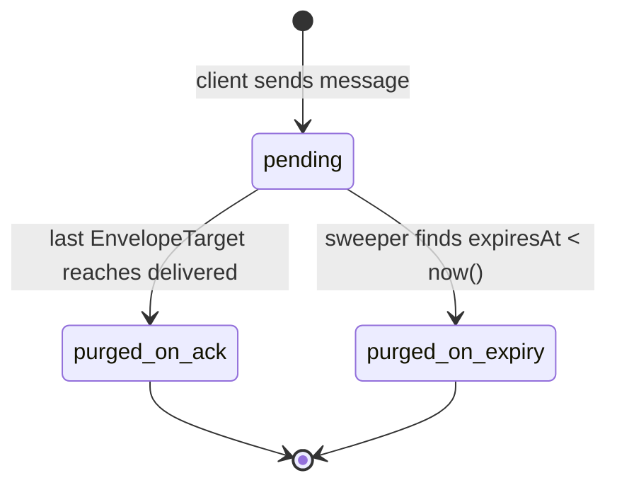
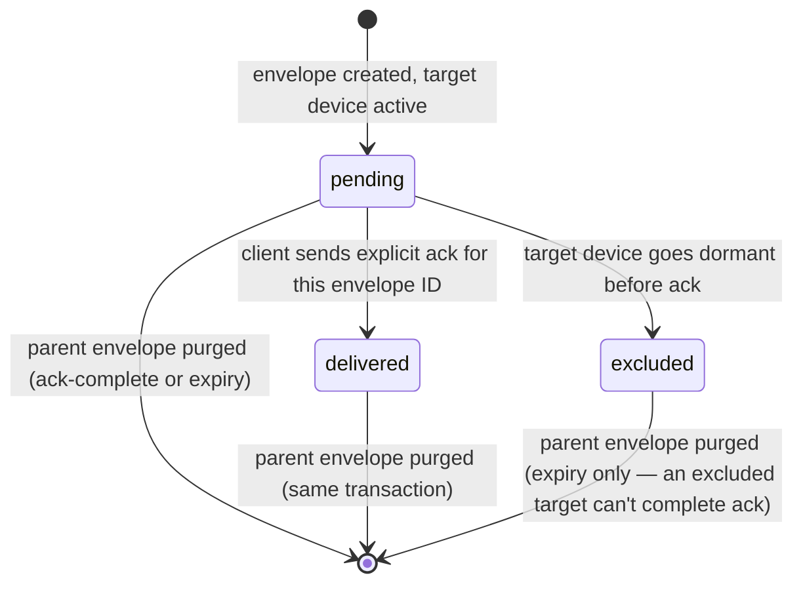

# Retention Model

**Status:** contract for the rest of the build. Every phase's exit gate that touches storage,
delivery, or purge is checked against this document. If code and this document disagree, the code
is wrong.

**Constant:** `RETENTION_WINDOW_DAYS = 30` (single global config value for MVP — not
per-conversation; see ADR-0002 for why). `DEVICE_DORMANCY_DAYS = 30` (default, same constant name
pattern, independently configurable).

## 1. Plain-English summary (the non-engineer version)

| Question | Answer |
|---|---|
| Where does my chat history live? | On your device(s) only. The server is not a backup. |
| How long does the server hold a message after I send it? | Until every recipient's every device has confirmed receipt — then it's deleted immediately. |
| What if a recipient never comes online? | The server holds it for up to 30 days, then deletes it — permanently, whether or not it was ever delivered. |
| What if I lose my phone? | You lose your history too, unless you exported an encrypted backup or linked a new device to an old one while it was still around. |
| What does the server keep forever? | Your account, your devices, who's in which conversation, and how many messages are queued for you — never the message text itself. |
| Can Driftline read my messages? | No code path exists that parses a message body server-side. It is opaque bytes from the moment it arrives to the moment it's deleted. |

## 2. What survives, and for how long

| Data | Where | Retention |
|---|---|---|
| Message / attachment **body** | `Envelope.payload` (Postgres, opaque bytes) + R2 object | Until last target delivered (immediate purge) or `expiresAt` (hard cap 30 days), whichever is first |
| Envelope **metadata** (id, conversationId, senderId, seq, size, contentType, createdAt, expiresAt) | Postgres | Deleted in the same transaction as the payload — metadata does not outlive the body |
| `EnvelopeTarget` rows (delivery state per recipient device) | Postgres | Deleted with the parent envelope |
| User account (id, email, displayName, avatar, createdAt) | Postgres | Until account deletion |
| Device record (id, userId, publicKey, platform, lastSeenAt, dormantAt, pushToken) | Postgres | Until revoked/deleted by user, or 30 days past dormancy with no return (configurable cleanup — see open question in §7) |
| Conversation + membership (id, type, members, roles, joinedAt) | Postgres | Until conversation/account deletion |
| `ConversationSequence` (monotonic counter, no content) | Postgres | Lifetime of the conversation |
| Presence / heartbeat state | Redis, TTL 30s | Seconds |
| Typing indicators | Redis, TTL a few seconds | Seconds |
| Push token | Postgres (on `Device`) | Same as device |
| Sweeper / purge logs | Structured logs (envelope ID, size, timestamp — never content) | Per log retention policy of the hosting platform |

The dividing line is exact: **routing and identity metadata is durable; content is transient.** If a
field could be used to reconstruct what was said, it lives in the transient half of this table, full
stop.

## 3. Entity lifecycle: `Envelope`

- Created when a client sends a message, reaction, receipt, or any other relayed event. `expiresAt`
  is set to `createdAt + RETENTION_WINDOW_DAYS` at creation time and never extended.
- `payload` and every `EnvelopeTarget` row for it are deleted **in the same database transaction**
  the instant the *last* target reaches `delivered`. There is no soft-delete flag, no nightly batch
  job for the ack path — this is the hot path, and it runs on every message.
- If not all targets ack before `expiresAt`, the sweeper deletes the envelope and all its targets
  regardless of remaining pending state. This is a hard, unconditional cutoff.
- Both purge paths emit a metric (`envelope_purged_total{reason="ack"|"expiry"}`) and a structured
  log line containing the envelope ID and size only — never the payload, never a hash of the
  payload, nothing content-derived.

## 4. Entity lifecycle: `EnvelopeTarget`

- One row per `(envelopeId, recipientUserId, deviceId)`. Group messages create one row per member
  device that is not dormant at send time.
- `pending → delivered` happens **only** on an explicit client ack carrying the envelope ID — never
  inferred from a socket event, a read receipt, or presence. Ack is its own message.
- A device that goes dormant *after* an envelope already targeted it does not retroactively lose the
  target — it can still ack when it returns, as long as the envelope hasn't expired. A device that is
  already dormant *at send time* is skipped entirely (see §5) and never gets a target row for that
  envelope, meaning it will receive a gap notice for it rather than a stale pending target.
- An envelope with **zero** targets (e.g., every member device is already dormant) is still written,
  still gets an `expiresAt`, and is still purged by the sweeper at expiry like anything else — there
  is no special-case immediate deletion for an empty target set, since the sender should get the
  normal 30-day window in case a device un-dormants.

## 5. Device dormancy

- A device is marked `dormantAt = now()` when it has not connected (no heartbeat, no reconnect) for
  `DEVICE_DORMANCY_DAYS` (default 30).
- Dormant devices are **excluded from new `EnvelopeTarget` creation** — new messages fan out only to
  active devices. This bounds worst-case storage: one permanently-offline device cannot pin envelopes
  indefinitely, because it simply stops receiving new targets.
- When a dormant device reconnects, it is reactivated (`dormantAt` cleared) and immediately receives
  a **gap notice** (see §6) rather than being silently caught up or silently left with a hole. It
  still receives any envelope-target rows that predate its dormancy and haven't yet expired — it is
  excluded only from *new* fan-out while dormant, not stripped of targets it already held.
- Revoking a device (user-initiated, e.g., "log out this device" in the device manager) is immediate
  and stronger than dormancy: it deletes the device's pending `EnvelopeTarget` rows outright and
  marks the device unable to reconnect. Dormancy is passive and reversible; revocation is active and
  final.

## 6. Gap notices

A gap notice is a client-visible system message inserted into the affected conversation's local
thread — never a silent hole in the timeline. It fires when the sync engine detects any of:

1. **Sequence gap** — the server-assigned per-conversation sequence number jumps by more than 1
   between two envelopes the device received, meaning something in between was purged (expired)
   before this device could fetch it.
2. **Dormancy return** — a device reconnects after being marked dormant and is told by the server
   that it was excluded from fan-out during that window.
3. **New/reinstalled device** — a device with no prior sync state joins a conversation that already
   has history elsewhere; it has nothing to gap-detect against, so it always shows the "history
   starts here" variant on its first sync rather than a numeric gap.

Copy is factual, not apologetic-sounding filler: *"Messages sent while this device was offline are no
longer available. Restore from a backup or sync from another device to recover them."* It links
directly to backup import and device-linking flows (Phase 6). Gap notices are computed client-side
from cursor/sequence state — the server does not need to know a gap "happened" beyond the fact that
it purged something; the client infers the gap from what it can no longer fetch.

## 7. Purge triggers — implementation checklist

- [ ] **Ack-triggered purge**: `EnvelopeTarget` update to `delivered` → check if it was the last
      pending target for its envelope → if so, delete payload + all targets + the envelope row, one
      transaction.
- [ ] **Sweeper**: scheduled job (`infra/scripts/sweeper`) querying `expiresAt < now()`, deleting in
      batches, emitting `envelope_purged_total{reason="expiry"}` and `sweeper_run_duration_seconds`.
- [ ] **Dormancy sweep**: separate scheduled check marking devices `dormantAt` past the threshold and
      excluding them from future fan-out queries (no deletion of the device record itself).
- [ ] **Revocation**: synchronous, user-triggered — deletes pending targets for that device
      immediately, does not wait for the sweeper.
- [ ] **Monitoring** (formalized in Phase 8, flagged here because it's a retention invariant): alert
      if the oldest *pending* envelope's age exceeds `RETENTION_WINDOW_DAYS` — that means the sweeper
      itself is broken and data is being retained silently past the contract.

## 8. Open question carried to Phase 2/8

Device *record* cleanup (as opposed to dormancy/exclusion-from-fan-out) is not yet fully specified:
should a device that has been dormant for a long time (e.g., 1 year) eventually have its record
purged entirely, or does it stay forever as an inert row tied to the account? Leaning toward "stays,
user can see and manually delete it in the device manager" since it's routing metadata, not content,
and R6 permits durable retention of exactly this kind of data — but this gets a final call and a line
in ADR-0002 once the device manager UI (Phase 5) makes the trade-off concrete.
